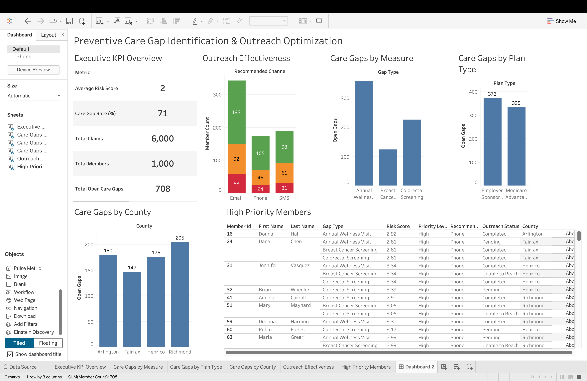

# Preventive Care Gap Identification & Outreach Optimization

> An end-to-end healthcare analytics pipeline for identifying members overdue for preventive services, stratifying risk, and powering population health outreach at scale.

---

## Table of Contents

- [Overview](#overview)
- [Business Problem](#business-problem)
- [Objectives](#objectives)
- [Preventive Care Measures](#preventive-care-measures)
- [Tech Stack](#tech-stack)
- [Project Architecture](#project-architecture)
- [Data Pipeline](#data-pipeline)
- [Dashboard Features](#dashboard-features)
- [Key Outcomes](#key-outcomes)
- [Getting Started](#getting-started)
- [Future Enhancements](#future-enhancements)
- [Author](#author)

---

## Overview

This project simulates a real-world **population health analytics** workflow commonly used by payer organizations, Medicare Advantage plans, and care management teams. It analyzes synthetic healthcare claims, member eligibility, and utilization data to:

- Detect preventive care gaps using CPT-code logic
- Prioritize high-risk members for outreach
- Generate dashboard-ready KPIs for operational and executive reporting

The solution covers the full analytics lifecycle — from raw data ingestion through risk stratification, outreach optimization, and Tableau visualization.

---

## Business Problem

Healthcare organizations need to proactively identify members overdue for preventive services such as screenings and wellness visits. Traditional manual reporting approaches are time-consuming, difficult to scale, and inefficient for outreach teams.

This project automates:

- Preventive care gap identification across multiple measure types
- Risk-based member prioritization
- Outreach channel recommendations and completion tracking
- Population health KPI reporting for executive and operational stakeholders

---

## Objectives

- Analyze healthcare claims and member demographic datasets
- Identify members overdue for preventive services using CPT-code logic
- Implement HEDIS-inspired preventive care measures
- Generate prioritized, actionable outreach lists
- Build interactive Tableau dashboards for care management teams
- Produce both operational and executive-level healthcare KPIs

---

## Preventive Care Measures

### Breast Cancer Screening

Identifies **female members aged 50–74** with no mammogram claim in the past 2 years.

| CPT Code | Description |
|----------|-------------|
| 77067 | Screening mammography, bilateral |
| 77066 | Diagnostic mammography, bilateral |

---

### Colorectal Cancer Screening

Identifies **members aged 45–75** with no colorectal screening claim in the past 5 years.

| CPT Code | Description |
|----------|-------------|
| 45378 | Colonoscopy, flexible |
| 82274 | Fecal occult blood test |

---

### Annual Wellness Visit

Identifies **members aged 65+** with no annual wellness visit claim during the current calendar year.

| CPT Code | Description |
|----------|-------------|
| G0438 | Annual wellness visit, initial |
| G0439 | Annual wellness visit, subsequent |

---

## Tech Stack

| Category | Tools & Technologies |
|----------|----------------------|
| Programming & Analytics | Python, SQL, Pandas, NumPy |
| Visualization | Tableau Public |
| Synthetic Data Generation | Faker |
| Healthcare Analytics Concepts | Population Health, HEDIS-Inspired Measures, Risk Stratification, CPT/ICD-10 Coding |

---

## Project Architecture

```
preventive-care-gap-project/
│
├── data/
│   ├── members.csv                      # Member demographics
│   ├── claims.csv                       # Historical claims data
│   ├── eligibility.csv                  # Member eligibility records
│   └── outreach.csv                     # Outreach tracking data
│
├── outputs/
│   ├── prioritized_outreach_list.csv    # Initial prioritized member list
│   ├── care_gap_summary.csv             # Summary of identified care gaps
│   ├── dashboard_kpis.csv               # KPI metrics for dashboard
│   ├── gap_by_measure.csv               # Gaps broken down by measure type
│   ├── gap_by_plan.csv                  # Gaps broken down by plan type
│   ├── gap_by_county.csv                # County-level gap analysis
│   ├── outreach_effectiveness.csv       # Outreach completion metrics
│   └── final_outreach_priority_list.csv # Final optimized outreach list
│
├── sql/
│   ├── 01_create_tables.sql             # Table schema definitions
│   └── 02_care_gap_queries.sql          # Care gap identification queries
│
├── src/
│   ├── generate_synthetic_data.py       # Synthetic healthcare data generation
│   ├── care_gap_pipeline.py             # Core care gap detection pipeline
│   ├── dashboard_kpi_generator.py       # KPI dataset generation
│   └── outreach_optimizer.py            # Outreach prioritization logic
│
├── screenshots/                         # Dashboard screenshots
├── dashboard/                           # Tableau workbook files
├── requirements.txt
└── README.md
```

---

## Data Pipeline

### Step 1 — Synthetic Healthcare Data Generation

Generates realistic healthcare datasets using the Faker library, including:

- Member demographics (age, gender, county, plan type)
- Historical claims with CPT codes and service dates
- Member eligibility records
- Baseline outreach tracking data

### Step 2 — Preventive Care Gap Identification

Python-based analytics pipeline that:

- Calculates member age from date of birth
- Analyzes preventive screening history against measure-specific lookback windows
- Detects overdue services using CPT-code matching logic
- Flags open care gaps per member and measure

### Step 3 — Risk-Based Member Prioritization

Members are scored and ranked using:

- Individual risk score analysis
- Number and severity of open care gaps
- Outreach recommendation logic to guide channel assignment

### Step 4 — Dashboard KPI Generation

Produces structured datasets for Tableau, including:

- Open care gap counts and gap rates
- County-level and plan-level breakdowns
- Outreach completion and effectiveness metrics

### Step 5 — Outreach Optimization

Simulates care management operations by:

- Recommending outreach channels (phone, mail, digital)
- Tracking outreach completion status
- Analyzing gap closure rates post-outreach
- Categorizing members into High / Medium / Low priority tiers

---

## Dashboard Features

### Executive KPI Overview
- Total Members
- Total Claims
- Open Care Gaps
- Average Risk Score
- Population-Level Care Gap Rate

### Care Gap Analysis
- Care Gaps by Measure (Breast Cancer, Colorectal, Wellness Visit)
- Care Gaps by Plan Type
- Care Gaps by County

### Outreach Effectiveness
- Outreach Completion Status
- Recommended Outreach Channels
- Gap Closure Metrics

### Operational Member Table
Drilldown view displaying high-priority members with risk scores, gap types, outreach status, and county-level information.

---

## Key Outcomes

- Automated end-to-end preventive care gap detection workflow
- Improved visibility into population health KPIs across plans and geographies
- Risk-stratified outreach lists to focus care management resources efficiently
- Reduced manual reporting effort through dashboard-ready output automation
- Simulated operational analytics environment reflective of real payer workflows

---
## Tableau Dashboard



## Getting Started

### Prerequisites

```bash
pip install -r requirements.txt
```

### Run the Full Pipeline

```bash
# Step 1: Generate synthetic healthcare data
python src/generate_synthetic_data.py

# Step 2: Identify preventive care gaps
python src/care_gap_pipeline.py

# Step 3: Generate dashboard KPI files
python src/dashboard_kpi_generator.py

# Step 4: Run outreach optimization
python src/outreach_optimizer.py
```

Output files will be written to the `outputs/` directory and are ready for import into Tableau.

---

## Future Enhancements

- Integration with real healthcare claims data sources
- Predictive risk scoring using machine learning models
- ML-based outreach channel optimization
- Real-time dashboard refresh via Tableau API
- Cloud deployment on AWS or Azure
- Automated ETL workflows with Apache Airflow

---

*This project demonstrates applied healthcare analytics skills including claims analysis, population health reporting, SQL cohort analysis, Python data processing, risk stratification, outreach optimization, and Tableau dashboard development.*